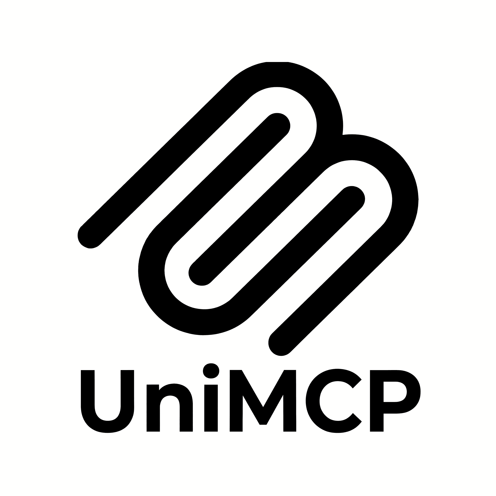

<h1 align="center">UniMCP</h1>

<p align="center">
  
</p>

<p align="center">
  Generic codebase-awareness MCP server. Drop into any project (PHP, TypeScript, Python, Go, Ruby, Java, Rust) and give Claude Code, Gemini, or any other MCP client a consistent set of tools for exploring code, symbols, and framework-specific structure.
</p>

### What it gives the agent

**Generic core (always on)**

- `read_file` — paginated by line
- `list_directory` — recursive, paginated
- `search_files` — regex + glob
- `list_docs` — markdown/text under configurable doc roots
- `list_symbols` — tree-sitter classes/interfaces/methods/functions
- `find_definition` — locate a named symbol
- `find_references` — identifier-level usage search

**Write tools (opt-in via `--allow-writes`)**

- `write_file`, `delete_file`, `create_directory`, `move_file` — all jailed to project root

**Plugins (auto-loaded when their marker file is present)**

- `php-composer` (when `composer.json` exists): `list_php_classes`, `find_php_class`, `list_composer_packages`

### Install & run

> Not yet published to npm — install directly from this repo.

```bash
# Bun (recommended — the CLI ships as TypeScript)
bun add github:Rockberpro/unimcp

# npm also works, but you'll need Bun (or tsx/ts-node) to actually run it
npm i github:Rockberpro/unimcp
```

You can pin a branch, tag, or commit:

```bash
bun add github:Rockberpro/unimcp#main
```

Run it from inside the project you want to expose:

```bash
bunx unimcp --root . --allow-writes
```

Or wire it into your MCP client config:

```json
{
  "mcpServers": {
    "unimcp": {
      "command": "bunx",
      "args": ["unimcp", "--root", "/absolute/path/to/project"]
    }
  }
}
```

If you prefer not to depend on Bun, run the CLI file directly via your TS runner of choice:

```bash
node --import tsx node_modules/unimcp/src/mcp/cli.ts --root .
```

### CLI flags

| Flag              | Description                                                             |
| ----------------- | ----------------------------------------------------------------------- |
| `--root <path>`   | Project root the server is jailed to. Defaults to `$MCP_ROOT` or `cwd`. |
| `--allow-writes`  | Enable mutation tools. Off by default.                                  |
| `--config <path>` | Path to `unimcp.config.json`. Defaults to `<root>/unimcp.config.json`.  |

### Optional `unimcp.config.json`

```json
{
  "docDirs": ["docs", ".claude/rules"],
  "ignoreDirs": ["node_modules", ".git", "vendor"],
  "pluginsDisabled": []
}
```

See `unimcp.config.example.json`.
